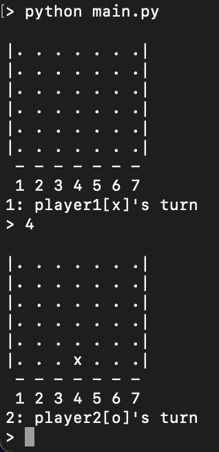
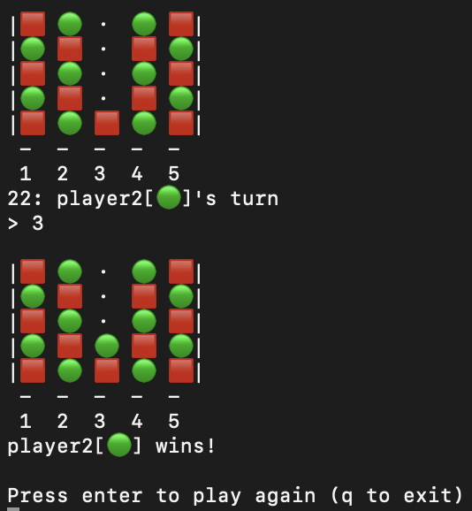

## dena-review


### usage
```
python main.py
```

```
optional arguments:
  -h, --help             show help message and exit

  -p1 P1, -player1 P1    symbol for player1's disc   (default 'x')
  -p2 P2, -player2 P2    symbol for player2's disc   (default 'o')
  -e E, -empty E         symbol for empty slots      (default '.')
  -s S, -separator S     string between column numbers (default ' ')
  (for better looking, P1, P2, E, and S should have the same width)

  -x X, -width X         board width   (default 7)
  -y Y, -height Y        board height  (default 6)
  -n N, -length N        length to win (default 4)
  (must satisfy 1 <= N <= min(x, y))

  -o FILE, -logfile FILE file to save results (default "./result.log")

```

The players rake turns to drop a disc on one of the columns.
The objective is to put `N` of your disc contiguously on a (horizontal, vertical, or diagonal) line.

### examples

```
python main.py
```



```
python main.py -p1 "🟥" -p2 "🟢" -e "・" -s "　" -x 5 -y 5
```



